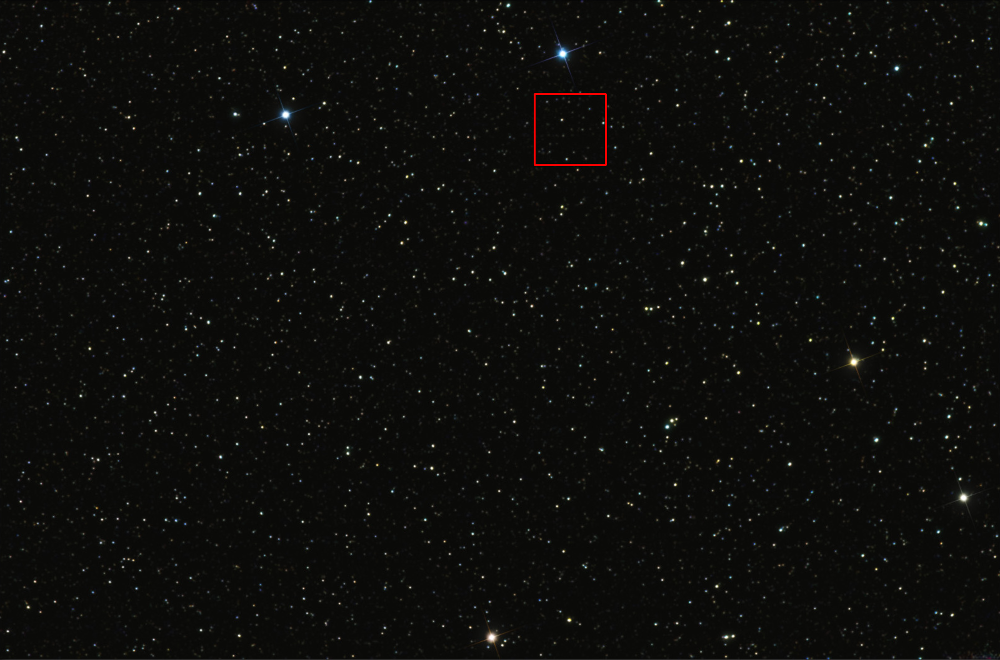
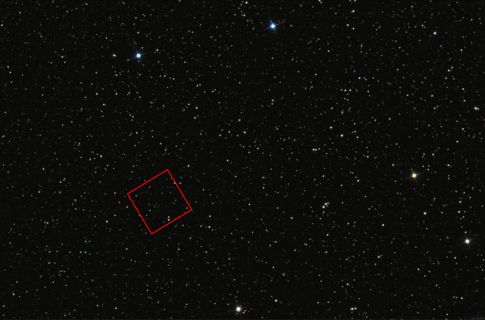

# 4dsight-cv-test

I implemented two solutions. First one works. The second solution did not work, however since I spent some time on it, I wanted to include it.

## Solution 1

### Solution Explanation

I used template matching functionality of OpenCV. To handle rotation, I rotate the small image for each angle and look for the angle that gave the maximum response (match). After that I find the location of the maximum match and take that as the coordinates where the small image appears in the big image with that angle.

### Compile

To compile: `$ g++ find_stars.cpp`  
You may need to add these flags to the end: ``pkg-config opencv --cflags --libs``  
Compiled program is already available as: `a.out`

### Results

## Solution 2

First I tried SIFT (and similar SURF, ORB, etc.) features to match keypoints and try to figure out transformation (homography) from that, however they don't seem to work well in astronomical images like these. I realized that I need features that are invariant to rotation. To solve this problem, the feature can be the ratios of the distances of stars from each other.

After a few google searches I stumbled upon this paper: 
[Astroalign: A Python module for astronomical image registration](https://arxiv.org/abs/1909.02946)

The paper suggests that we iterate over each star and get its 4 closest neighbors and then we form triangles by (5 choose 3) points. In my implementation, I took the centroids of these triangles as keypoint locations and the ratios of edges of these triangles as descriptor of these keypoints. Here, the ratios of the edges of triangles are identifiers for the triangles. This way I attempted to create features robust to rotation and hoping to match from small image to big image and come up with a translation. Unfortunately, I did not observe a robust matching from small image to big image. However, I am still including it here just for the idea. You can find the implementation in `solution2` folder as Jupyter Notebook. I was trying to prototype the algorithm for this one in Python.
